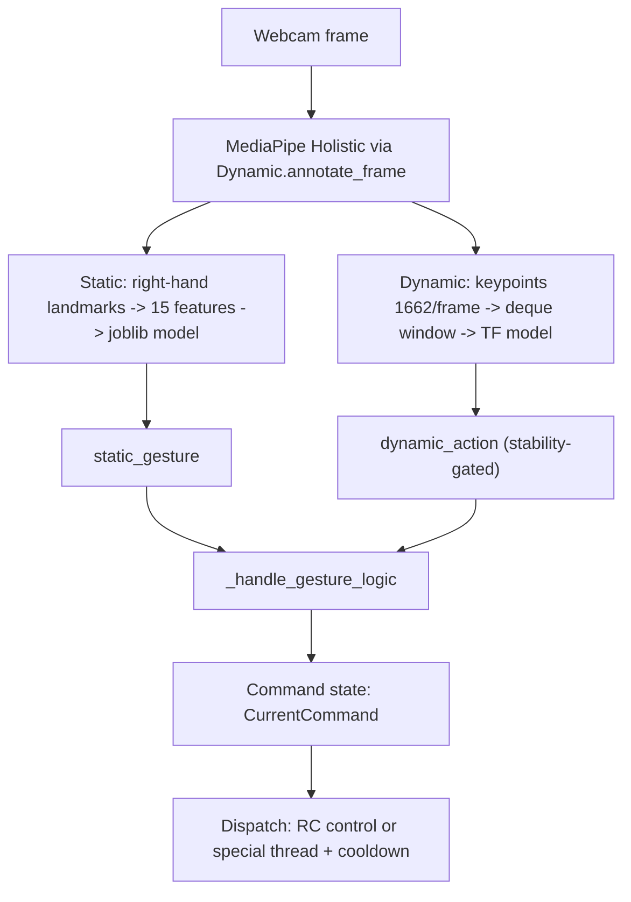

# DroneControl (Gesture → Command → Drone)

This folder contains the **runtime controller** that connects gesture recognition to drone movement. It combines:

- **Static gestures** (single-frame hand pose) for mode-like commands (e.g. `HALT`)
- **Dynamic actions** (sequence-based) for movement and special actions (e.g. `FLY_LEFT`, `TAKE_ONOFF`, `FLIP`)

The implementation is designed to run in **debug mode** (no drone connection) or in **live mode** (connects to a DJI Tello via `djitellopy`).

---

## 1) Purpose & Stack

**Vision:** translate human hand/body gestures into safe, stable drone commands in real time:

- keep control latency low (webcam → inference → command mapping)
- avoid command flicker with stability logic for dynamic actions
- prevent repeated dangerous actions via cooldown + threading

**Core building blocks (module-level):**

- **Static model** (`joblib`) using a 15-feature hand vector
- **Dynamic model** (Keras) consuming a keypoint sequence buffer
- **Command state machine** (`CurrentCommand`)
- **Dispatch layer** (RC control vs special actions with cooldown + threading)

---

## 2) Structure

Inside `DroneControl/`:

- `drone_control.py`
  - Main class `DroneControl`
  - Opens webcam, runs MediaPipe Holistic, executes static + dynamic prediction
  - Maps gestures/actions to `CurrentCommand` and dispatches Tello commands
  - Supports `debug=True` mode (no drone connection)
- `gestureRecognition.py`
  - `landmark_normalization(...)`: produces a **15-feature** vector from 21 hand landmarks (distance-based)
- `States.py`
  - `CurrentCommand`: enum used as a shared command state machine
- `__init__.py`
  - package exports

Key dependencies outside this folder:

- `config/drone.py`: thresholds, cooldown, velocity scaling factors, model artifact paths
- `config/gestures.py`: label maps (`STATIC_HAND_GESTURES`, `DYNAMIC_ACTIONS`)
- `config/dynamic.py`: `SEQUENCE_LENGTH`, `STABLE_LENGTH` used to stabilize dynamic actions
- `Dynamic/` module:
  - `Dynamic.mediapipe_utils.annotate_frame` + `mp_holistic`
  - `Dynamic.keypoints.extract_keypoints` (1662-dim vector)
  - `Dynamic.model.load_model` (dynamic action model)

---

## 3) Local Setup (The 10-Minute Start)

### Prerequisites (specific to this module)

- A webcam (used by `DroneControl.DroneControl` via OpenCV)
- Model artifacts available at the configured paths (see `config/drone.py`)
- (Live mode) a DJI Tello reachable on the network

### Running

The runtime entrypoint is `main.py` (repo root). Quit with `q`.

---

## 5) Architectural Patterns

### End-to-end runtime flow

### Stability gating for dynamic actions

Dynamic predictions are only accepted when:

- the controller has collected a full window of length `SEQUENCE_LENGTH`
- the predicted class index stays constant for `STABLE_LENGTH` consecutive predictions

This avoids jitter from frame-to-frame noise.

### Safety & special actions

Special actions (`TAKE_ONOFF`, `FLIP`) are executed in a **background thread** and throttled by a **cooldown** (`COOLDOWN_SECONDS`) to avoid repeated takeoff/land/flip triggers.

### Command mapping rules (high level)

- If static gesture is `HALT`, movement is immediately suppressed (commands reset to IDLE for that cycle).
- Movement actions map to directional commands (`FLY_LEFT`, `FLY_UP`, …).
- Motor power is derived from `VELOCITY_FACTOR_X/Y/Z` and the current command state.

---

## Notes on model paths

Default artifact paths come from `config/drone.py`:

- Static model: `Static/models/140k.joblib`
- Dynamic model: `Dynamic/models/actionNoFlip.keras`

If you move/rename artifacts, update `config/drone.py` accordingly.

