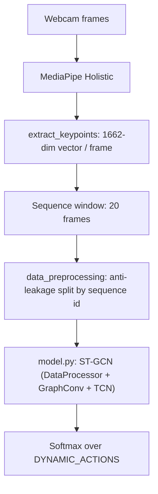

# Dynamic (Sequence) Gesture Recognition

This folder contains the **dynamic / sequence-based gesture recognition** pipeline: data collection with **MediaPipe Holistic**, preprocessing with an **anti-leakage split**, and model training/evaluation (default: a **Spatial-Temporal GCN**).

---

## 1) Purpose & Stack

**Vision:** classify short sequences of human pose/hand motion into discrete actions (e.g. `FLY_LEFT`, `ROTATE`, `FLIP`) using webcam-based keypoints. This module focuses on *temporal* gestures (motion over time), not single-frame hand signs.

**Core building blocks (module-level):**

- **MediaPipe Holistic** → landmark detection
- **Keypoint vectors** (`extract_keypoints`) → 1662 features per frame
- **Sequence windowing** → fixed-length sequences for classification
- **Keras model** → default architecture is **ST‑GCN** (`model.py`)

---

## 2) Structure

Where things live inside `Dynamic/`:

- **Dataset generation**
  - `data_collection.py`: records sequences from webcam, saves `.npy` keypoint vectors, generates augmentations.
  - `keypoints.py`: converts MediaPipe Holistic results into a fixed **1662-dim** vector per frame.
  - `mediapipe_utils.py`: MediaPipe detection wrapper + styled landmark drawing helpers.
- **Preprocessing**
  - `data_preprocessing.py`: loads `.npy` sequences and performs a **sequence-ID-based train/test split** to prevent data leakage.
  - `convert_to_relational.py`: optional utility to transform absolute coordinates into **nose-relative** coordinates and write a mirrored dataset.
- **Models**
  - `model.py`: **ST-GCN** model (default in training), including custom layers (`DataProcessor`, `GraphConv`).
  - `lstm.py`: **legacy** LSTM model kept for reference/experiments (not used by `train.py` by default).
  - `models/`: saved `.keras` models (default path is configured in `config/dynamic.py`).
- **Train / eval / visualization**
  - `train.py`: training entrypoint with TensorBoard + checkpoint + quick evaluation.
  - `evaluate.py`: evaluate a saved model on the held-out test split.
  - `visualization.py`: renders real-time probability bars onto frames (UI helper).

Related configuration (outside this folder):

- `config/dynamic.py`: dataset path, sequence length, model path, hyperparameters.
- `config/gestures.py`: `DYNAMIC_ACTIONS` label list.

---

## 3) Local Setup

### Prerequisites (specific to this module)

- A working webcam (OpenCV capture uses device `0` by default) for `data_collection.py`
- Enough disk space for `.npy` datasets under `Dynamic/TrainingData/`

### Dataset location & layout

By default, data is written under:

- `Dynamic/TrainingData/DynamicRecognition/` (configured by `config/dynamic.py` as `DATASET_DIR`)

Expected layout:

```text
Dynamic/TrainingData/DynamicRecognition/
  TAKE_ONOFF/
    0/0.npy ... 19.npy
    0_aug_rot/...
    0_aug_trans/...
    0_aug_scale/...
    0_flipped/0.npy ... 19.npy
    0_flipped_aug_rot/...
    ...
  FLY_LEFT/
  ...
```

Each `*.npy` frame file stores a **1662-length** vector:

- Pose: 33 landmarks × (x, y, z, visibility) = 132
- Face: 468 landmarks × (x, y, z) = 1404
- Left hand: 21 × (x, y, z) = 63
- Right hand: 21 × (x, y, z) = 63
- Total: 132 + 1404 + 63 + 63 = **1662**

---

## 5) Architectural Patterns

### Dataflow (high level)



### Anti-leakage split (important)

`data_preprocessing.py` splits by **sequence ID** (e.g. `0..NO_SEQUENCES-1`), so that:

- the **original** sequence and its **standard augmentations** (`_aug_rot`, `_aug_trans`, `_aug_scale`)
- stay entirely in **train** *or* entirely in **test**

This avoids training on an augmented copy of the exact same motion you evaluate on.

### “Flipped” data policy

`data_collection.py` writes both original and `_flipped` sequences.  
`data_preprocessing.py` **explicitly excludes flipped variants** by design ( this is done for anatomical consistency, it matters depending on wheter or not mirroring the gesture changes it's meaning).

If you want to train with flipped samples, you must change the preprocessing policy accordingly.

### Model note: ST‑GCN vs legacy LSTM

- `train.py` imports `create_model` from `Dynamic.model` ⇒ **ST-GCN is the default** training architecture.
- `lstm.py` exists as a baseline/legacy option, but it is not wired into `train.py` unless you switch imports.

---

## Common commands

| Task | Command |
|---|---|
| Collect data (interactive, press `q` to stop) | `python Dynamic\data_collection.py` |
| Collect data (rewrite dataset) | `python Dynamic\data_collection.py --rewrite` |
| Extend dataset (copy + flipped + augmentations) | `python Dynamic\data_collection.py --append` |
| Train + quick eval | `python Dynamic\train.py` |
| Evaluate saved model | `python Dynamic\evaluate.py` |
| TensorBoard (logs dir from `config/dynamic.py`) | `tensorboard --logdir Logs` |

