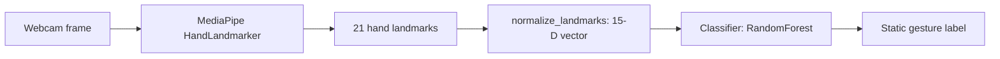

# Static (Single-Frame) Hand Gesture Recognition

This folder contains the **static / single-frame** hand gesture recognition tooling used in PixelFlight. It focuses on classifying a **single hand pose** (no temporal sequence) using **MediaPipe HandLandmarker** + a lightweight **feature vector** and a classical ML classifier (Random Forest).

---

## 1) Project Vision & Stack

**Vision:** detect a hand from a webcam frame, extract a compact numeric representation, and classify it into a discrete command (e.g. `FORWARD`, `TAKEOFF`, `XYCONTROL`) for fast, low-latency control.

**Core building blocks (module-level):**

- **MediaPipe Tasks HandLandmarker** → 21 hand landmarks
- **Feature engineering** (`normalize_landmarks`) → 15 distance-based features
- **Classifier** (`RandomForestClassifier`) → predicts a static gesture label
- **Persistence** (`joblib`) → saves/loads `.joblib` artifacts

---

## 2) Repository Roadmap (The Map)

Where things live inside `Static/`:

- **Feature extraction & dataset utilities**
  - `data_utils.py`
    - `normalize_landmarks(...)`: converts 21 hand landmarks into a **15-dimensional** feature vector (distances)
    - CSV helpers (`save_data_to_csv`, `load_sequences_from_csv`, `expand_training_data`)
- **MediaPipe Tasks integration**
  - `mediapipe_utils.py`
    - `get_hand_landmarker(...)`: initializes `HandLandmarker` using `models/hand_landmarker.task`
    - `process_frame_with_mediapipe(...)`: runs inference in VIDEO/IMAGE mode
    - `draw_hand_landmarks(...)`: draws landmarks on a frame
- **Data collection**
  - `trainingDataPrepper.py`: interactive webcam app to collect labeled samples into a CSV
- **Training**
  - `randomForest.py`: trains/evaluates a `RandomForestClassifier` from a CSV and saves a `.joblib` model
- **Model assets**
  - `models/`
    - `hand_landmarker.task`: MediaPipe hand detection/tracking model (required by the collector)
    - `*.joblib`: trained classical models (e.g. `140k.joblib`, `15-feature.joblib`)
    - `*.keras`: experimental neural models (not wired into `randomForest.py`)
    - `yolov8n.pt`: auxiliary asset (not used by the scripts in this folder)

Related configuration (outside this folder):

- `config/gestures.py`: `STATIC_HAND_GESTURES` label mapping used by the broader project.

---

## 3) Local Setup (The 10-Minute Start)

### Prerequisites (specific to this module)

- A working webcam for `trainingDataPrepper.py`
- MediaPipe task model present at `Static/models/hand_landmarker.task`

### Verify MediaPipe asset exists

The data collector expects this file to exist:

```text
Static/models/hand_landmarker.task
```

---

## 4) Development Workflow

### Implementation guidelines (specific to `Static/`)

- Keep **feature definitions stable**: changing `normalize_landmarks` changes the meaning of your dataset and invalidates saved models.
- Keep model assets in `Static/models/` and don’t hardcode absolute paths.
- Prefer small, testable functions; `tests/Static/` already mocks OpenCV/MediaPipe to keep tests fast.

### Running tests

| Goal | Command |
|---|---|
| Run all tests | `python runTests.py` |
| Run only Static tests | `pytest -v tests/Static -p no:cacheprovider --disable-warnings` |

---

## 5) Architectural Patterns

### Feature engineering: 15-D distance vector

`data_utils.normalize_landmarks(...)` builds a **15-dimensional** feature vector:

- **5 distances**: wrist → each fingertip (`4, 8, 12, 16, 20`)
- **10 distances**: all pairwise distances between the 5 fingertips

This intentionally ignores absolute position and focuses on **hand shape**.

### End-to-end flow



### Dataset & label conventions (important)

There are two “label sources” in the repo:

- `config/gestures.py` defines `STATIC_HAND_GESTURES` (includes e.g. `HALT`)
- `trainingDataPrepper.py` uses its own key mapping (includes `LANDING`)

When you train a model, ensure that **your dataset labels** match the labels you want to use at runtime.

---

## 6) Definition of Done (DoD)

Before opening a PR that changes `Static/`:

- **Tests**: `pytest -v tests/Static ...` passes.
- **Feature stability**: the 15-D feature vector definition remains consistent with existing datasets and `.joblib` models.
- **Label consistency**: labels used in collection/training match the labels expected by the consumer.

---

## Common commands

| Task | Command |
|---|---|
| Collect labeled samples (interactive) | `python Static\trainingDataPrepper.py` |
| Train + evaluate RandomForest | `python Static\randomForest.py` |
| Run Static tests | `pytest -v tests/Static -p no:cacheprovider --disable-warnings` |

---

## Notes on CSV formats (practical)

`Static/randomForest.py` currently expects a **headered** CSV at:

- `Static/gesture_training_data_expanded.csv`

with a label column named:

- `gesture`

If your collector output differs (e.g. no headers), you can either:

- update `CSV_FILE_PATH` / `LABEL_COLUMN` in `Static/randomForest.py`, or
- convert your raw CSV into a headered one.

Example conversion script (creates a headered CSV from rows shaped like: 15 features + label):

```python
import pandas as pd

raw_path = "Static/gesture_training_data_teststs.csv"
out_path = "Static/gesture_training_data_expanded.csv"

df = pd.read_csv(raw_path, header=None)
df.columns = [f"f{i}" for i in range(15)] + ["gesture"]
df.to_csv(out_path, index=False)

print("Wrote:", out_path, "rows:", len(df))
```

